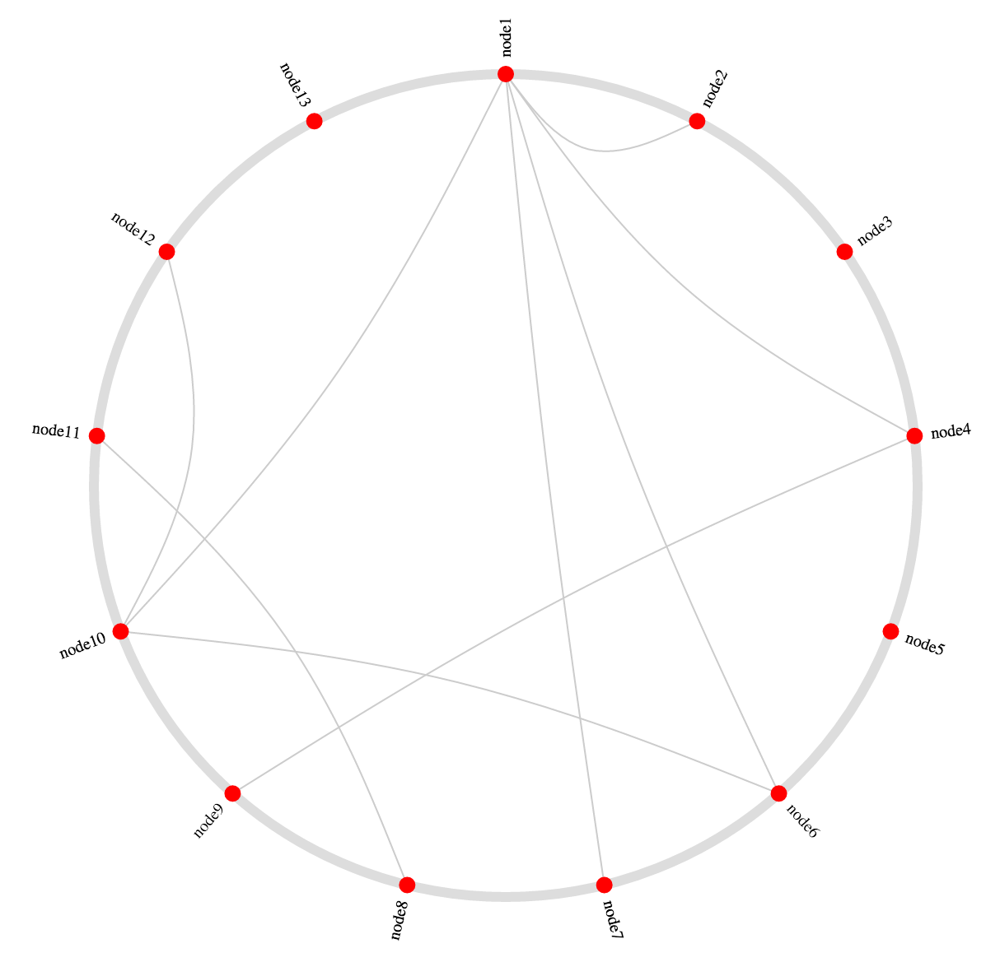
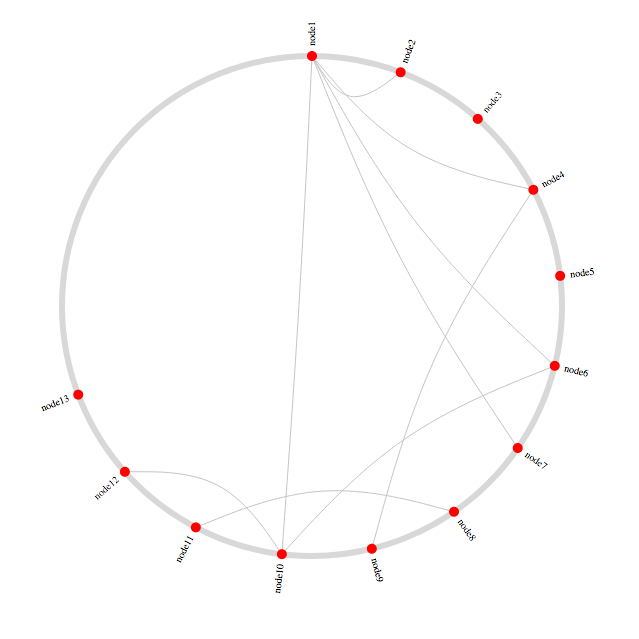

d3.layout.circleGraph
====================================================

A d3 layout generator for visualizing a graph using a circle of nodes and chords connecting them.
Kind of like [this block](http://bl.ocks.org/sjengle/5432087) by [sjengle](http://bl.ocks.org/sjengle).



```bash
bower install d3-layout-circle-graph
```

Demo
----------------------------------------------------

The demo that the above screenshot is taken from is located in `demo.html`.


Usage
----------------------------------------------------

First, include `circleGraph.js` in your project, either manually or with bower.

```javascript
var myRadius = 100;
var myNodes = [
  { name: 'node1' },
  { name: 'node2' },
  { name: 'node3' }
];
var myEdges = [
  { source: 'node1', target: 'node2' },
  { source: 'node1', target: 'node3' }
];

var layout = d3.layout.circleGraph()
  .radius(myRadius)
  .tension(0.3)
  .nodes(myNodes)
  .edges(myEdges);
```

The node objects will be endowed with `x`, `y`, `radians`, `radianRange`, and `degrees` properties. These can be used to visualize the graph as a circle. Note that 0° is assumed to be 12 o'clock, and increases going clockwise.

### `node.x`, `node.y`

The `x` and `y` coordinates for the center of the node.

### `node.radians`, `node.degrees`

The radians and degrees around the circle that the node resides.

### `node.radianRange`

An array of two radian values that give the "range" of a particular node (good for visualizing bands, etc).

The edge objects will be endowed with a `coords` property, which is an array of three coordinates: the source node point, the center of the circle (as a control point), and the target node point.


API
----------------------------------------------------

### `d3.layout.circleGraph()`

Creates the layout object.

### `circleGraph.radius([Number])`

Sets the radius of the circle.

### `circleGraph.line`

Line function that can be used for drawing chords.

### `circleGraph.tension([Number])`

Sets the tension of the `bundle` line function that is available at `circleGraph.line`. Should be a number between 0 and 1.

### `circleGraph.nodes([nodes])`

Runs the layout on the provided nodes, adding the `x`, `y`, `radians` and `degrees` properties. By default, assumes that there is an identifying property called `name` on each node. To change this behavior, use the `circleGraph.key` function.

### `circleGraph.edges([edges])`

Runs the layout on the provided edges, adding a `coords` array to each edge. By default, this assumes that there are two properties on each edge object: a `source` property and a `target` property. This can be changed with the `circleGraph.edgeSource` and `circleGraph.edgeTarget` methods, respectively.

### `circleGraph.key([fn])`

Sets the accessor function used to identify a node. By default, this function is:

```javascript
function key(node) {
  return node.name;
}
```

### `circleGraph.edgeSource([fn])`

Sets the accessor function used to find the source node's identity from an edge object. By default, this function is:

```javascript
function edgeSourceAccessor(edge) {
  return edge.source;
}
```

### `circleGraph.edgeTarget([fn])`

Same as `edgeSource`, but for the target. Default is: 

```javascript
function edgeTargetAccessor(edge) {
  return edge.target;
}
```

### `circleGraph.nodeMap()`

Returns an object that maps identities to nodes. Sometimes useful in client code.


### `circleGraph.range([number])`

Sets or gets the "range" in radians of a complete circle within which the nodes should be evenly distributed. Default is `Math.PI * 2` (which represents the complete circle).

For example, calling `circleGraph.range(Math.PI * 3/2)` on the demo will result in this:



> **WARNING:** This must be called _before_ `.nodes()` gets called.